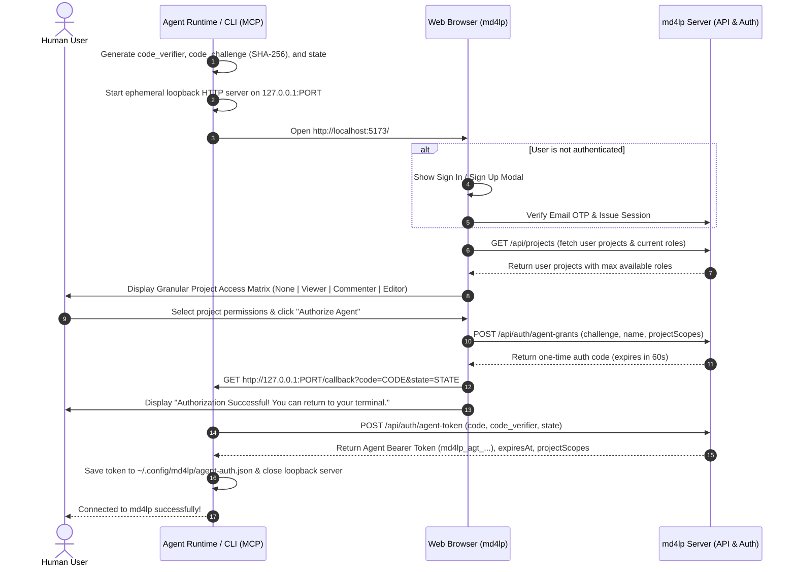

# md4lp — Technical Specification & Plan: Agent Access, Scoped MCP & CLI Integration

> **Version:** 1.1.0  
> **Status:** Architecture Approved / Ready for Implementation  
> **Target:** Punto de parada D (Agent Access, MCP & CLI Auth)  

---

## 1. Architectural Philosophy & Overview

In **md4lp**, AI agents (such as Claude Desktop, Cursor, Antigravity, or custom autonomous scripts) do not operate as detached, unmonitored service accounts. Instead, they act **on-behalf-of an authenticated user** through explicit, granular delegation.

### Key Tenets

1. **User Delegation (*On-Behalf-Of Authorization*)**:
   - A token represents: *"User $U$ authorizes Agent $A$ to perform tasks on their behalf."*
2. **Dynamic Role Capping**:
   - The effective privilege of an agent in any project is strictly capped at runtime:
     $$\text{EffectiveRole}(A, P) = \min(\text{DelegatedRole}(A, P), \text{CurrentRole}(U, P))$$
   - Delegable roles are strictly restricted to: `editor`, `commenter`, and `viewer` (excluding `owner` to protect project administration).
   - If a user loses access or has their role downgraded in a project or team, all delegated agents immediately and automatically reflect that restriction without requiring token re-issuance.
3. **Loopback Authorization Flow with PKCE (RFC 7636)**:
   - CLI and MCP runtimes launch a local loopback server (`127.0.0.1:<port>`), generate `code_verifier` and `code_challenge`, and open the md4lp web app for interactive, visual authorization.
   - The web app returns a single-use 60-second `authorization_code` to the loopback callback, which the client exchanges for the token using its `code_verifier`.
4. **Sliding Idle Timeout (24h) + Absolute Hard Limit (7 Days)**:
   - **Sliding Idle Timeout**: An agent session expires if no active tool/API calls occur within **24 hours** (`idleTimeoutMs = 86_400_000`). Functional calls (read, edit, comment) renew `lastUsedAt`.
   - **Absolute Expiration Limit**: Regardless of continuous activity, the session hard-expires after **7 days** (`absoluteExpiresAt = createdAt + 7 * 86_400_000`), requiring user re-authorization.
5. **No Tokens in URLs**:
   - Prohibited in query strings. All agent authentication requires `Authorization: Bearer <token>`.
6. **Agent Lock Ownership**:
   - Edit locks are tagged with `agentSessionId` to prevent separate agent sessions of the same user from colliding or releasing each other's locks.
7. **Git Attribution & Audit Trail**:
   - Commits are created with:
     - `Author`: User's name and verified contextual email for the project.
     - `Committer`: `md4lp server <server@md4lp.local>`.
     - Commit Trailer: `X-md4lp-Agent: <agentName> (Session: <prefix>)`.

---

## 2. Authorization Flow Sequence (PKCE Loopback)



---

## 3. Data Model & Entity Schemas

### 3.1 `AgentSession` & `AgentGrant`

```typescript
export type DelegatedAgentRole = 'editor' | 'commenter' | 'viewer'

export interface AgentProjectScope {
  projectId: string
  maxRole: DelegatedAgentRole
}

export interface AgentSession {
  id: string
  userId: string
  agentName: string
  description?: string
  tokenHash: string // SHA-256 of the plain Bearer token
  tokenPrefix: string // First 8 chars for audit (e.g. "md4lp_agt_")
  
  projectScopes: AgentProjectScope[] // Explicit allowed projects
  
  createdAt: number
  lastUsedAt: number
  idleTimeoutMs: number // 24 * 60 * 60 * 1000 (24h)
  absoluteExpiresAt: number // createdAt + 7 * 24 * 60 * 60 * 1000 (7 days)
  status: 'active' | 'revoked'
}

export interface PendingAgentCode {
  code: string
  userId: string
  agentName: string
  codeChallenge: string
  projectScopes: AgentProjectScope[]
  expiresAt: number // now + 60_000 (60s)
}
```

---

## 4. MCP Server Protocol & Tool Specifications

All MCP tools require `Authorization: Bearer md4lp_agt_...` and explicit `projectId`:

| Tool | Parameters | Description | Required Role |
| :--- | :--- | :--- | :--- |
| `md4lp_auth_status` | *(none)* | Returns authenticated user info, agent name, idle countdown, 7-day expiration date, and list of authorized projects with effective roles. | Any active session |
| `md4lp_list_projects` | *(none)* | Lists authorized projects for this agent session. | `read` |
| `md4lp_list_files` | `projectId` | Lists Markdown files in the project's repository. | `viewer`+ |
| `md4lp_read_file` | `projectId`, `path` | Reads byte-exact Markdown content and current lock holder. | `viewer`+ |
| `md4lp_acquire_lock` | `projectId`, `path` | Acquires the single-editor lock for this agent session. | `editor` |
| `md4lp_edit_file` | `projectId`, `path`, `content`, `message` | Auto-saves changes to the live ephemeral branch. | `editor` (must hold lock) |
| `md4lp_release_lock` | `projectId`, `path` | Consolidates edits to `main` and releases the document lock. | `editor` |
| `md4lp_list_comments` | `projectId`, `path` | Lists anchored comments, threads, and reactions. | `viewer`+ |
| `md4lp_add_comment` | `projectId`, `path`, `startText`, `endText`, `body` | Creates an anchored comment or reply. | `commenter`+ |
| `md4lp_suggest_change` | `projectId`, `path`, `targetText`, `replacement` | Creates an inline replacement suggestion. | `commenter`+ |

---

## 5. Comprehensive Implementation Plan

The implementation is broken down into 4 coherent phases:

### Phase 1: Backend Storage, PKCE Exchange & Session Lifecycle (`@md4lp/server`)
1. **Types & Models**: Add `AgentSession`, `AgentProjectScope`, `PendingAgentCode` in `src/auth/types.ts` and `src/projects/types.ts`.
2. **Store Layer**: Implement `createPendingAgentCode`, `consumePendingAgentCode`, `createAgentSession`, `getAgentSessionByHash`, `updateAgentSessionActivity`, `listAgentSessionsForUser`, `revokeAgentSession` in `src/auth/store.ts`.
3. **Session Verification & Lifecycle Service**:
   - `AuthService.createAgentGrantCode(userId, input)` (generates 60s code with PKCE challenge).
   - `AuthService.exchangeAgentCodeForToken(code, verifier)` (verifies PKCE SHA-256 challenge, issues `md4lp_agt_...` token, sets 24h idle + 7-day absolute limit).
   - `AuthService.validateAgentToken(token)` (checks hash, active status, `Date.now() - lastUsedAt <= 24h`, `Date.now() <= absoluteExpiresAt`, updates `lastUsedAt`).
4. **CASL Integration & Caller Resolution**:
   - Update `resolveCaller` in `src/identity.ts` to validate Bearer tokens.
   - Dynamic role capping: `ability` computed as $\min(\text{projectScope.maxRole}, \text{userCurrentRole})$.
5. **REST Endpoints (`src/api.ts`)**:
   - `POST /api/auth/agent-grants` (web consent form submits requested scopes & PKCE challenge).
   - `POST /api/auth/agent-token` (CLI exchanges code + verifier for token).
   - `GET /api/auth/agent-sessions` (list user's active agent sessions).
   - `DELETE /api/auth/agent-sessions/:id` (revoke agent session).

### Phase 2: MCP Server & Stdio CLI Bridge (`@md4lp/server` & CLI)
1. **MCP Transport & Authorization Middleware**:
   - Update `packages/server/src/mcp.ts` to enforce Bearer token authentication on Streamable HTTP transport and Stdio bridge.
   - Add session activity renewal on functional tool calls.
2. **MCP Tool Handlers**:
   - Implement `md4lp_auth_status`, `md4lp_list_projects`, `md4lp_list_files`, `md4lp_read_file`, `md4lp_acquire_lock`, `md4lp_edit_file`, `md4lp_release_lock`, `md4lp_list_comments`, `md4lp_add_comment`, `md4lp_suggest_change`.
   - Ensure all document mutations use the agent session ID for lock tagging and Git commit attribution.
3. **CLI Commands**:
   - `md4lp auth login`: Starts loopback server, creates PKCE verifier/challenge, opens browser `#authorize-agent`, receives callback, exchanges code, and saves to `~/.config/md4lp/agent-auth.json`.
   - `md4lp auth status`: Displays current agent token status, remaining idle time, and 7-day expiration.
   - `md4lp auth logout`: Clears stored local token.
   - `md4lp mcp --stdio`: Runs MCP server over stdio using stored credentials.

### Phase 3: Web UI (`@md4lp/web`)
1. **Consent Screen `#authorize-agent`**:
   - URL hash routing `#authorize-agent?port=...&name=...&challenge=...&state=...`.
   - If not logged in, prompt sign-in, then display consent dialog.
   - Project access matrix table with role selectors (`None`, `Viewer`, `Commenter`, `Editor`) capped at user's current level.
   - "Authorize" button POSTs to `/api/auth/agent-grants`, receives code, and triggers loopback callback `http://127.0.0.1:PORT/callback?code=...&state=...`.
2. **Account Settings — Connected Agents Tab**:
   - View active agent sessions, agent name, project permissions, last active time, and 7-day expiration date.
   - "Disconnect / Revoke" button connected to `DELETE /api/auth/agent-sessions/:id`.

### Phase 4: Automated Testing & Verification
1. **Vitest Unit Tests**:
   - PKCE challenge generation and verification (valid verifier, invalid verifier, reused code).
   - Sliding 24h idle timeout expiration and renewal.
   - 7-day absolute limit enforcement.
   - Role capping and dynamic permission revocation ($A \le U$).
   - Lock ownership per agent session.
2. **MCP Integration Tests**:
   - End-to-end tool execution over MCP protocol with agent token auth.
3. **Playwright E2E Tests**:
   - Full browser-assisted loopback authorization flow with dummy local HTTP listener.
   - Management and revocation from Account Settings UI.
